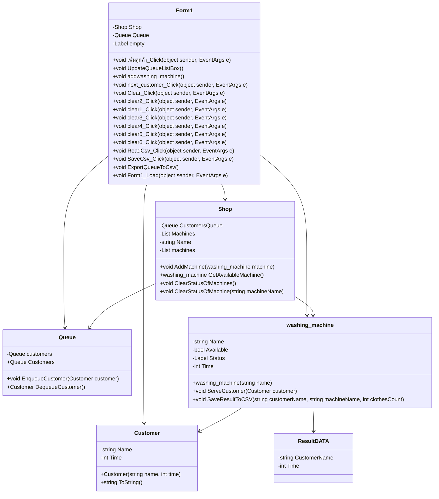

# Project1
1:ความเป็นมาของโปรแกรม

โปรแกรมนี้ถูกพัฒนาขึ้นเพื่อแก้ไขปัญหาที่เกิดขึ้นในร้านซักผ้า
โดยปัญหาที่พบคือการจัดการคิวของลูกค้าที่มาใช้บริการซักผ้าโดยไม่มีระบบที่ช่วยในการจัดการคิวอย่างเป็นระบบ
โดยโปรแกรมนี้จะมาช่วยในเรื่องการจัดคิวทำให้เป็นระเบียบ

2:วัตถุประสงค์ของโปรแกรม
วัตถุประสงค์ของโปรแกรมนี้เป็นการช่วยเพิ่มประสิทธิภาพในการจัดการร้านซักผ้าด้วยการทำคิวและการจัดการเครื่องซักผ้าอย่างมีประสิทธิภาพ 
โดยมีวัตถุประสงค์หลักคือ

ลดเวลารอคิวของลูกค้า: โปรแกรมช่วยให้การจัดการคิวของลูกค้าเป็นไปอย่างมีระเบียบและรวดเร็ว
ลดเวลารอคิวของลูกค้าที่มาใช้บริการซักผ้าในร้านซักผ้า

เพิ่มประสิทธิภาพในการทำงานของร้านซักผ้า: โดยการจัดการคิวและการทำงานของเครื่องซักผ้าอย่างมีประสิทธิภาพ
ร้านซักผ้าสามารถทำงานได้อย่างเต็มประสิทธิภาพและสามารถรับลูกค้าเพิ่มเติมได้โดยไม่เสียเวลา

3.มีการใช้คุณสมบัติทาง OOP อย่างน้อย 3 อย่างภายในโครงการ (Information hiding, Encapsulation, Inheritance, Polymorphism ) (10 คะแนน)
:
การสร้าง Class: โปรแกรมมีการสร้างคลาสต่างๆ เพื่อแยกแยะระหว่างสิ่งต่างๆ ในโปรแกรม เช่น Customer, Queue, washing_machine, Shop เป็นต้น แต่ละคลาสมีความรับผิดชอบและหน้าที่ของตนเอง

การสร้าง Object: โปรแกรมสร้างอ็อบเจกต์ของคลาสเพื่อใช้งาน เช่น Customer, Queue, washing_machine, Shop เป็นต้น แต่ละอ็อบเจกต์จะมีคุณสมบัติและพฤติกรรมของตัวเอง

การใช้ Encapsulation: คุณสมบัติและเมธอดของคลาสถูกป้องกันและจัดการเป็น private หรือ protected เพื่อป้องกันการเข้าถึงโดยตรง โดยส่วนใหญ่จะเข้าถึงผ่านเมธอด getter และ setter

การใช้ Inheritance: คลาส Shop อาจมีการสืบทอดคุณสมบัติและพฤติกรรมจากคลาสหรืออินเทอร์เฟซที่เกี่ยวข้อง เช่น ในกรณีนี้ Shop สืบทอดคุณสมบัติของคลาส Queue และ washing_machine ในบางกรณี

การใช้ Polymorphism: โปรแกรมใช้การสร้างเมธอดที่มีชื่อเดียวกันในคลาสต่างๆ แต่มีพฤติกรรมที่แตกต่างกัน เช่น เมธอด ClearStatusOfMachine() ในคลาส Shop ที่มีการดำเนินการต่างกันตามชื่อของเครื่องซักผ้าที่ระบุ

การใช้ Composition: ในกรณีนี้ Shop มีการประกอบด้วยอ็อบเจกต์ของคลาสอื่น ๆ เช่น Queue และ washing_machine เพื่อรวมฟังก์ชันและข้อมูลเข้าด้วยกันในแต่ละร้าน

การใช้ Method Overloading: โปรแกรมใช้การสร้างเมธอดที่มีชื่อเหมือนกันแต่มีจำนวนหรือประเภทของพารามิเตอร์ที่แตกต่างกัน เช่น ClearStatusOfMachine() ในคลาส Shop มีเวอร์ชันที่รับพารามิเตอร์เป็นชื่อเครื่องซักผ้า

4.มีการอ่านและบันทึกข้อมูลลงบนไฟล์ (.CSV) (5 คะแนน)
:ชื่อไฟล์customers_queue
ตำแหน่งไฟล์ source\repos\Project1\Projectปี1\Projectปี1\bin\Debug\net8.0-windows
classdiagram:

5.ชื่อของผู้พัฒนาโปรแกรม
นาย เสฎฐวุฒิ  สุทธิสมณ์ 663450044-4

ข้อเสนอแนะ
โครงการนี้เป็นโครงการเบื้องต้นในการจัดทำเพื่อแก้ปัญหาในเรื่องของการใช้เวลาในการจองคิวเครื่องซักผ้าโดยเน้นในระบบร้านสะดวกซักขนาดเล็กอย่างเช่นที่มีอยู่ในที่มีบริการอยู่ในแถวหอพักมหาลัยขอนแก่นวิทยาเขตหนองคายเท่านั้นแต่ใน 
project นี้สามารถขยายเพื่อพัฒนา application หรือโปรแกรมในการจองคิวเครื่องซักผ้าที่ใช้การตั้งเวลาในการจองได้กำหนดเวลาในการจองได้และรวมไปถึงสามารถขยายไปถึงเรื่องของการจองคิวเครื่องอบผ้าโดยใช้การตั้งเวลากำหนดเวลาในการจองได้ซึ่งเราก็เพียงแต่เพิ่มในส่วนของเวลาเข้าไปเกี่ยวข้องกับโปรแกรมมากขึ้นเท่านั้นและน่าจะนำไป ประยุกต์ใช้กับร้านสะดวกซักในทุกรูปแบบและทั่วประเทศไทยได้
